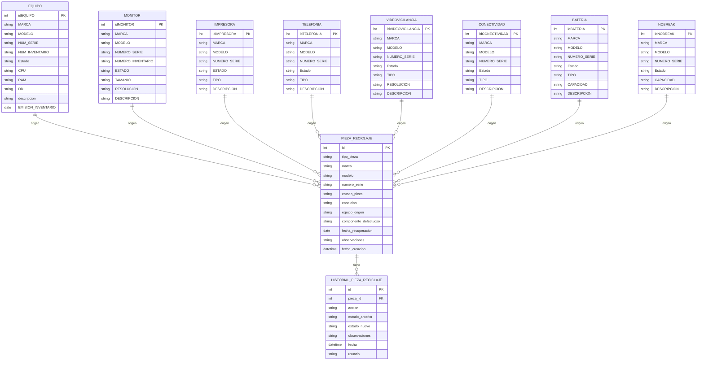
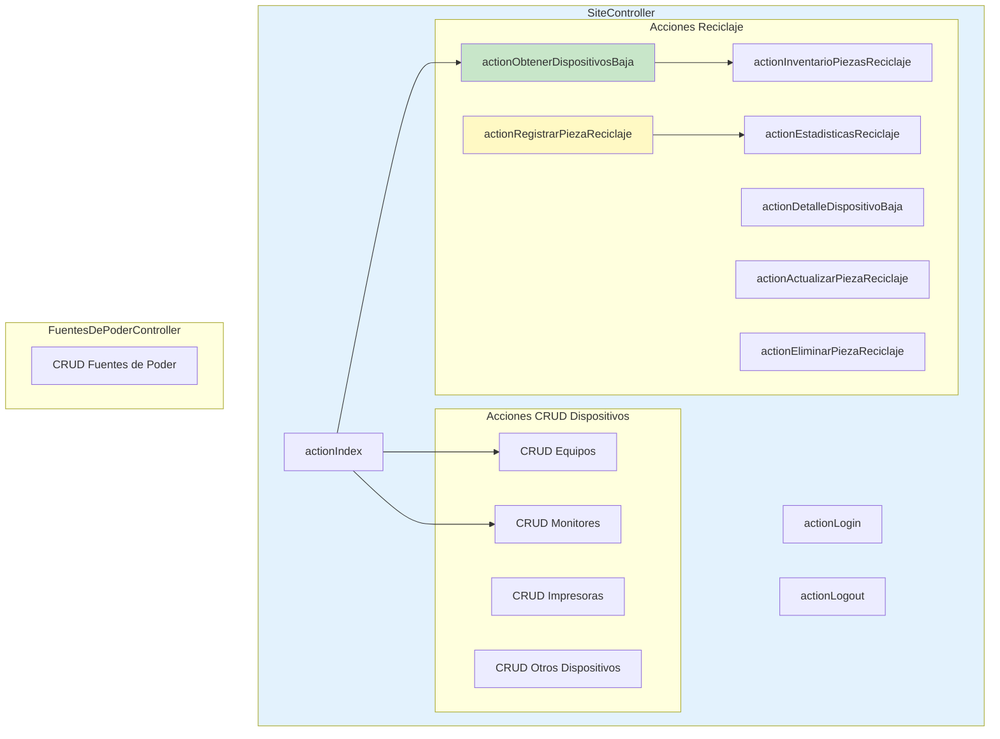

# Diagrama de Arquitectura del Sistema - Altas y Bajas de Equipos

## Arquitectura General del Sistema

```mermaid
graph TB
    subgraph "Capa de Presentación"
        Usuario[� Usuario]
        Browser[🌐 Navegador Web]
    end
    
    subgraph "Frontend - Yii2 Framework"
        subgraph "Vistas"
            VIndex[index.php - Dashboard]
            VReciclaje[reciclaje-piezas.php]
            VDispositivos[Vistas CRUD Dispositivos]
        end
        
        subgraph "Controladores"
            SiteController[SiteController]
            FuentesController[FuentesDePoderController]
        end
        
        subgraph "Modelos - ActiveRecord"
            MDispositivos[Equipos, Monitores, Impresoras<br/>Telefonía, VideoVigilancia<br/>Conectividad, Baterías, NoBreak]
            MComponentes[Procesadores, RAM<br/>Almacenamiento, Fuentes, Sonido]
            MReciclaje[PiezaReciclaje<br/>HistorialPiezaReciclaje]
        end
        
        subgraph "Assets"
            CSS[Bootstrap 5<br/>CSS Personalizado]
            JS[JavaScript/jQuery<br/>SweetAlert2<br/>Font Awesome]
        end
    end
    
    subgraph "Base de Datos MySQL"
        subgraph "Tablas Dispositivos"
            TEquipo[(equipo)]
            TMonitor[(monitor)]
            TImpresora[(impresora)]
            TTelefonia[(telefonia)]
            TVideo[(videovigilancia)]
            TConect[(conectividad)]
            TBateria[(bateria)]
            TNobreak[(nobreak)]
        end
        
        subgraph "Tablas Componentes"
            TProcesador[(procesador)]
            TRam[(ram)]
            TAlmacen[(almacenamiento)]
            TFuentes[(fuentesdepoder)]
            TSonido[(sonido)]
        end
        
        subgraph "Tablas Reciclaje"
            TPieza[(pieza_reciclaje)]
            THistorial[(historial_pieza_reciclaje)]
        end
    end
    
    %% Flujo de Usuario
    Usuario -->|Interactúa| Browser
    Browser -->|HTTP Request| SiteController
    Browser -->|HTTP Request| FuentesController
    
    %% Controladores y Vistas
    SiteController -->|Renderiza| VIndex
    SiteController -->|Renderiza| VReciclaje
    SiteController -->|Renderiza| VDispositivos
    FuentesController -->|Renderiza| VDispositivos
    
    %% Vistas y Assets
    VIndex -.->|Usa| CSS
    VReciclaje -.->|Usa| CSS
    VDispositivos -.->|Usa| CSS
    VReciclaje -.->|Ejecuta| JS
    
    %% Controladores y Modelos
    SiteController -->|CRUD| MDispositivos
    SiteController -->|CRUD| MReciclaje
    FuentesController -->|CRUD| MComponentes
    
    %% Modelos y Base de Datos
    MDispositivos -->|ORM| TEquipo
    MDispositivos -->|ORM| TMonitor
    MDispositivos -->|ORM| TImpresora
    MDispositivos -->|ORM| TTelefonia
    MDispositivos -->|ORM| TVideo
    MDispositivos -->|ORM| TConect
    MDispositivos -->|ORM| TBateria
    MDispositivos -->|ORM| TNobreak
    
    MComponentes -->|ORM| TProcesador
    MComponentes -->|ORM| TRam
    MComponentes -->|ORM| TAlmacen
    MComponentes -->|ORM| TFuentes
    MComponentes -->|ORM| TSonido
    
    MReciclaje -->|ORM| TPieza
    MReciclaje -->|ORM| THistorial
    
    %% Response
    VReciclaje -.->|Response HTML| Browser
    Browser -.->|Visualiza| Usuario
    
    %% Estilos
    style Usuario fill:#4CAF50,stroke:#2E7D32,color:#fff
    style Browser fill:#2196F3,stroke:#1565C0,color:#fff
    style SiteController fill:#FF9800,stroke:#E65100,color:#fff
    style VReciclaje fill:#9C27B0,stroke:#6A1B9A,color:#fff
    style MReciclaje fill:#F44336,stroke:#C62828,color:#fff
    style TPieza fill:#607D8B,stroke:#37474F,color:#fff
    style THistorial fill:#607D8B,stroke:#37474F,color:#fff
    
    classDef dbStyle fill:#FFE082,stroke:#F57C00,stroke-width:2px
    class TEquipo,TMonitor,TImpresora,TTelefonia,TVideo,TConect,TBateria,TNobreak,TProcesador,TRam,TAlmacen,TFuentes,TSonido dbStyle
```

## 2. Módulo de Reciclaje de Piezas - Arquitectura

```mermaid
graph LR
    subgraph "Vista - reciclaje-piezas.php"
        UI[Interfaz Usuario]
        Stats[Estadísticas]
        Listado[Listado Dispositivos]
        Modal[Modales]
    end
    
    subgraph "SiteController - Acciones"
        ActObtenerDisp[actionObtenerDispositivosBaja]
        ActDetalleDisp[actionDetalleDispositivoBaja]
        ActInventario[actionInventarioPiezasReciclaje]
        ActRegistrar[actionRegistrarPiezaReciclaje]
        ActActualizar[actionActualizarPiezaReciclaje]
        ActEliminar[actionEliminarPiezaReciclaje]
    end
    
    subgraph "Modelos"
        MEquipo[Equipo]
        MMonitor[Monitor]
        MImpresora[Impresora]
        MTelefonia[Telefonia]
        MVideo[VideoVigilancia]
        MConect[Conectividad]
        MBateria[Bateria]
        MNobreak[Nobreak]
        MPieza[PiezaReciclaje]
        MHistorial[HistorialPiezaReciclaje]
    end
    
    UI -->|Fetch API| ActObtenerDisp
    UI -->|Ver Detalles| ActDetalleDisp
    UI -->|Inventario| ActInventario
    
    ActObtenerDisp --> MEquipo
    ActObtenerDisp --> MMonitor
    ActObtenerDisp --> MImpresora
    ActObtenerDisp --> MTelefonia
    ActObtenerDisp --> MVideo
    ActObtenerDisp --> MConect
    ActObtenerDisp --> MBateria
    ActObtenerDisp --> MNobreak
    
    ActInventario --> MPieza
    ActRegistrar --> MPieza
    ActRegistrar --> MHistorial
    ActActualizar --> MPieza
    ActEliminar --> MPieza
    
    style UI fill:#d4edda
    style ActObtenerDisp fill:#fff3cd
    style MPieza fill:#cfe2ff
```

## 3. Flujo de Datos - Obtención de Dispositivos de Baja

```mermaid
sequenceDiagram
    participant U as Usuario
    participant V as Vista (reciclaje-piezas.php)
    participant C as SiteController
    participant M as Modelos (Equipo, Monitor, etc.)
    participant DB as Base de Datos
    
    U->>V: Accede a página de reciclaje
    activate V
    V->>V: cargarPiezasRecientes()
    V->>C: fetch('/site/obtener-dispositivos-baja')
    activate C
    
    C->>M: Equipo::find()->where(['Estado' => 'BAJA'])
    activate M
    M->>DB: SELECT * FROM equipo WHERE Estado='BAJA'
    DB-->>M: Resultados Equipos
    M-->>C: Array Equipos
    deactivate M
    
    C->>M: Monitor::find()->where(['Estado' => 'BAJA'])
    activate M
    M->>DB: SELECT * FROM monitor WHERE ESTADO='BAJA'
    DB-->>M: Resultados Monitores
    M-->>C: Array Monitores
    deactivate M
    
    Note over C,M: Se repite para cada categoría:<br/>Impresoras, Telefonía, VideoVigilancia,<br/>Conectividad, Baterías, NoBreak
    
    C->>C: Agrupa y ordena dispositivos
    C-->>V: JSON { success, data[], contadores{} }
    deactivate C
    
    V->>V: Agrupa por categoría
    V->>V: Renderiza secciones HTML
    V-->>U: Muestra listado organizado
    deactivate V
```

## 4. Modelo de Datos - Reciclaje de Piezas

## 5. Componentes de la Vista - reciclaje-piezas.php

```mermaid
graph TD
    subgraph "Interfaz de Usuario"
        Hero[Hero Section]
        Stats[Tarjetas de Estadísticas]
        Listado[Listado Principal]
        Sidebar[Panel Lateral - Categorías]
        Modals[Modales]
    end
    
    subgraph "Listado Principal"
        SecEquipos[Sección: Equipos de Cómputo]
        SecMonitores[Sección: Monitores]
        SecImpresoras[Sección: Impresoras]
        SecTelefonia[Sección: Telefonía]
        SecVideo[Sección: Video Vigilancia]
        SecConect[Sección: Conectividad]
        SecBaterias[Sección: Baterías]
        SecNobreak[Sección: No Break]
    end
    
    subgraph "Detalles por Dispositivo"
        Icono[Ícono de Categoría]
        Titulo[Título/Descripción]
        Badge[Badge de Categoría]
        InfoBasica[Marca, Modelo, Serie]
        InfoDetalle[Columna Detalles]
        Fecha[Fecha de Baja]
    end
    
    Hero --> Stats
    Stats --> Listado
    Listado --> SecEquipos
    Listado --> SecMonitores
    Listado --> SecImpresoras
    Listado --> SecTelefonia
    Listado --> SecVideo
    Listado --> SecConect
    Listado --> SecBaterias
    Listado --> SecNobreak
    
    SecEquipos --> Icono
    SecEquipos --> Titulo
    SecEquipos --> Badge
    SecEquipos --> InfoBasica
    SecEquipos --> InfoDetalle
    SecEquipos --> Fecha
    
    Sidebar -.-> Listado
    
    style Hero fill:#d4edda
    style Listado fill:#fff3cd
    style Sidebar fill:#cfe2ff
```

## 6. Funciones JavaScript Principales

```mermaid
graph LR
    subgraph "Funciones de Carga Inicial"
        CargarEstadisticas[cargarEstadisticas]
        CargarPiezas[cargarPiezasRecientes]
        ActualizarContadores[actualizarContadoresCategorias]
    end
    
    subgraph "Funciones de Procesamiento"
        AgruparDispositivos[Agrupar por Categoría]
        RenderizarSecciones[Renderizar Secciones HTML]
        FormatearFecha[formatearFecha]
    end
    
    subgraph "Funciones de Interacción"
        VerDetalles[verDetallesDispositivo]
        VerInventario[verInventario]
        RegistrarPieza[registrarPieza]
        EditarPieza[editarPieza]
    end
    
    CargarPiezas --> AgruparDispositivos
    AgruparDispositivos --> RenderizarSecciones
    CargarPiezas --> ActualizarContadores
    RenderizarSecciones --> FormatearFecha
    
    VerDetalles -.->|Modal| SweetAlert2
    VerInventario -.->|Modal| Bootstrap
    
    style CargarPiezas fill:#28a745,color:#fff
    style RenderizarSecciones fill:#17a2b8,color:#fff
```

## 7. Flujo de Registro de Nueva Pieza

```mermaid
sequenceDiagram
    participant U as Usuario
    participant V as Vista
    participant F as Formulario
    participant C as SiteController
    participant M as PiezaReciclaje
    participant H as HistorialPiezaReciclaje
    participant DB as Base de Datos
    
    U->>V: Click "Registrar Pieza"
    V->>F: Mostrar Modal con Formulario
    U->>F: Completa datos de la pieza
    U->>F: Click "Guardar"
    F->>F: Validar campos requeridos
    
    alt Validación exitosa
        F->>C: POST /site/registrar-pieza-reciclaje
        activate C
        C->>M: new PiezaReciclaje()
        M->>M: Asignar atributos
        M->>M: validate()
        
        alt Validación modelo exitosa
            M->>DB: INSERT INTO pieza_reciclaje
            DB-->>M: ID insertado
            M->>H: Crear historial
            H->>DB: INSERT INTO historial_pieza_reciclaje
            DB-->>H: OK
            C-->>F: JSON {success: true}
            deactivate C
            F->>V: Cerrar modal
            V->>V: cargarPiezasRecientes()
            V-->>U: Mostrar mensaje éxito
        else Validación fallida
            M-->>C: Errores de validación
            C-->>F: JSON {success: false, errors}
            F-->>U: Mostrar errores
        end
    else Validación fallida
        F-->>U: Mostrar campos requeridos
    end
```

## 8. Estructura de Controladores

## 9. Tecnologías y Dependencias

## 10. Estados de Dispositivos

```mermaid
stateDiagram-v2
    [*] --> Activo: Nuevo Dispositivo
    Activo --> Inactivo: Sin Asignar
    Activo --> Mantenimiento: Reparación
    Mantenimiento --> Activo: Reparado
    Inactivo --> Activo: Reasignado
    Activo --> Dañado: Proceso de Baja
    Dañado --> BAJA: Dado de Baja
    Inactivo --> BAJA: Obsoleto/Actualización
    
    BAJA --> DisponibleReciclaje: Evaluación de Piezas
    DisponibleReciclaje --> PiezasRecuperadas: Extracción
    PiezasRecuperadas --> [*]: Reciclado
    
    note right of BAJA
        Estado objetivo para
        el módulo de reciclaje
    end note
    
    note right of DisponibleReciclaje
        Se muestran en
        reciclaje-piezas.php
    end note
```

---

## Notas Técnicas

### Convenciones de Código
- **Modelos**: Uso de ActiveRecord de Yii2
- **Controladores**: RESTful cuando es posible
- **Vistas**: Uso de PHP + HTML + Bootstrap
- **AJAX**: Fetch API moderna en lugar de jQuery.ajax

### Seguridad Implementada
- CSRF protection habilitada
- Validación de datos en servidor
- Sanitización de inputs
- Control de acceso basado en roles (AccessControl)

### Base de Datos
- Motor: MySQL/MariaDB
- Charset: utf8mb4
- Collation: utf8mb4_unicode_ci
- Transacciones para operaciones críticas

---

**Generado**: 2026-01-08  
**Proyecto**: Sistema de Altas y Bajas de Equipos - ITSVA  
**Módulo Principal**: Reciclaje de Piezas
