# Diagrama de Funcionalidades del Frontend - Sistema de Gestión de Equipos

## Código para mermaidchart.com

```mermaid
graph TB
    Start([👤 Usuario])
    
    subgraph "🔐 Autenticación"
        Login[Login - Iniciar Sesión]
        Signup[Signup - Registro]
        Logout[Logout - Cerrar Sesión]
        ResetPass[Recuperar Contraseña]
    end
    
    subgraph "🏠 Dashboard Principal"
        Index[Index - Página Principal]
        Stats[Estadísticas Generales]
    end
    
    subgraph "➕ Agregar Nuevos Dispositivos"
        AgregarMenu[Menú Agregar Nuevo]
        
        AgregarEquipo[Agregar Equipo]
        AgregarMonitor[Agregar Monitor]
        AgregarImpresora[Agregar Impresora]
        AgregarNobreak[Agregar No-Break]
        AgregarBateria[Agregar Batería]
        AgregarSonido[Agregar Equipo Sonido]
        AgregarConectividad[Agregar Conectividad]
        AgregarTelefonia[Agregar Telefonía]
        AgregarVideo[Agregar VideoVigilancia]
    end
    
    subgraph "📋 Gestión por Categorías"
        GestionMenu[Menú Gestión Categorías]
        
        subgraph "💻 Equipos de Cómputo"
            ListarEquipos[Listar Equipos]
            VerEquipo[Ver Detalle Equipo]
            EditarEquipo[Editar Equipo]
            EliminarEquipo[Eliminar Equipo]
            CambiarEstado[Cambiar Estado Masivo]
        end
        
        subgraph "🖥️ Monitores"
            ListarMonitores[Listar Monitores]
            VerMonitor[Ver Detalle Monitor]
            EditarMonitor[Editar Monitor]
            EliminarMonitor[Eliminar Monitor]
        end
        
        subgraph "🖨️ Impresoras"
            ListarImpresoras[Listar Impresoras]
            VerImpresora[Ver Detalle Impresora]
            EditarImpresora[Editar Impresora]
            EliminarImpresora[Eliminar Impresora]
        end
        
        subgraph "⚡ No-Break"
            ListarNobreak[Listar No-Break]
            VerNobreak[Ver Detalle No-Break]
            EditarNobreak[Editar No-Break]
            EliminarNobreak[Eliminar No-Break]
        end
        
        subgraph "🔋 Baterías"
            ListarBaterias[Listar Baterías]
            VerBateria[Ver Detalle Batería]
            EditarBateria[Editar Batería]
            EliminarBateria[Eliminar Batería]
        end
        
        subgraph "🔊 Equipo de Sonido"
            ListarSonido[Listar Sonido]
            VerSonido[Ver Detalle Sonido]
            EditarSonido[Editar Sonido]
            EliminarSonido[Eliminar Sonido]
        end
        
        subgraph "🌐 Conectividad"
            ListarConectividad[Listar Conectividad]
            VerConectividad[Ver Detalle]
            EditarConectividad[Editar Conectividad]
            EliminarConectividad[Eliminar]
        end
        
        subgraph "📞 Telefonía"
            ListarTelefonia[Listar Telefonía]
            VerTelefonia[Ver Detalle]
            EditarTelefonia[Editar Telefonía]
            EliminarTelefonia[Eliminar]
        end
        
        subgraph "📹 VideoVigilancia"
            ListarVideo[Listar VideoVigilancia]
            VerVideo[Ver Detalle]
            EditarVideo[Editar VideoVigilancia]
            EliminarVideo[Eliminar]
        end
    end
    
    subgraph "🔧 Gestión de Componentes"
        ComponentesMenu[Menú Componentes]
        
        subgraph "🧠 Procesadores"
            ListarProcesadores[Listar Procesadores]
            VerProcesador[Ver Detalle]
            EditarProcesador[Editar Procesador]
            EliminarProcesador[Eliminar]
        end
        
        subgraph "💾 Memoria RAM"
            ListarRAM[Listar RAM]
            VerRAM[Ver Detalle RAM]
            EditarRAM[Editar RAM]
            EliminarRAM[Eliminar RAM]
        end
        
        subgraph "💿 Almacenamiento"
            ListarAlmacenamiento[Listar Almacenamiento]
            VerAlmacenamiento[Ver Detalle]
            EditarAlmacenamiento[Editar]
            EliminarAlmacenamiento[Eliminar]
        end
        
        subgraph "⚙️ Fuentes de Poder"
            ListarFuentes[Listar Fuentes]
            VerFuente[Ver Detalle]
            EditarFuente[Editar Fuente]
            EliminarFuente[Eliminar]
        end
    end
    
    subgraph "📦 Inventario y Stock"
        Stock[Ver Stock General]
        Reportes[Generar Reportes]
        ExportarDatos[Exportar Datos]
    end
    
    subgraph "♻️ Reciclaje de Piezas"
        ReciclajePiezas[Módulo Reciclaje]
        
        ListarBaja[Listar Dispositivos en BAJA]
        VerDetallesBaja[Ver Detalles Dispositivo]
        RegistrarPieza[Registrar Pieza Reciclada]
        InventarioPiezas[Ver Inventario Piezas]
        ActualizarPieza[Actualizar Pieza]
        EliminarPiezaRec[Eliminar Pieza]
        HistorialPieza[Ver Historial]
    end
    
    subgraph "📊 Historial y Auditoría"
        HistorialBajas[Historial de Bajas]
        VerBajasCategoria[Ver Bajas por Categoría]
        FiltrarBajas[Filtrar Historial]
        ExportarBajas[Exportar Bajas]
    end
    
    %% Flujo de Autenticación
    Start --> Login
    Login -->|Credenciales| Index
    Start --> Signup
    Signup -->|Registro exitoso| Login
    Login --> ResetPass
    Index --> Logout
    
    %% Flujo Dashboard
    Index --> Stats
    Index --> AgregarMenu
    Index --> GestionMenu
    Index --> Stock
    Index --> ReciclajePiezas
    Index --> HistorialBajas
    
    %% Flujo Agregar Dispositivos
    AgregarMenu --> AgregarEquipo
    AgregarMenu --> AgregarMonitor
    AgregarMenu --> AgregarImpresora
    AgregarMenu --> AgregarNobreak
    AgregarMenu --> AgregarBateria
    AgregarMenu --> AgregarSonido
    AgregarMenu --> AgregarConectividad
    AgregarMenu --> AgregarTelefonia
    AgregarMenu --> AgregarVideo
    
    %% Flujo Gestión por Categorías
    GestionMenu --> ListarEquipos
    ListarEquipos --> VerEquipo
    ListarEquipos --> EditarEquipo
    ListarEquipos --> EliminarEquipo
    ListarEquipos --> CambiarEstado
    
    GestionMenu --> ListarMonitores
    ListarMonitores --> VerMonitor
    ListarMonitores --> EditarMonitor
    ListarMonitores --> EliminarMonitor
    
    GestionMenu --> ListarImpresoras
    ListarImpresoras --> VerImpresora
    ListarImpresoras --> EditarImpresora
    ListarImpresoras --> EliminarImpresora
    
    GestionMenu --> ListarNobreak
    ListarNobreak --> VerNobreak
    ListarNobreak --> EditarNobreak
    ListarNobreak --> EliminarNobreak
    
    GestionMenu --> ListarBaterias
    ListarBaterias --> VerBateria
    ListarBaterias --> EditarBateria
    ListarBaterias --> EliminarBateria
    
    GestionMenu --> ListarSonido
    ListarSonido --> VerSonido
    ListarSonido --> EditarSonido
    ListarSonido --> EliminarSonido
    
    GestionMenu --> ListarConectividad
    ListarConectividad --> VerConectividad
    ListarConectividad --> EditarConectividad
    ListarConectividad --> EliminarConectividad
    
    GestionMenu --> ListarTelefonia
    ListarTelefonia --> VerTelefonia
    ListarTelefonia --> EditarTelefonia
    ListarTelefonia --> EliminarTelefonia
    
    GestionMenu --> ListarVideo
    ListarVideo --> VerVideo
    ListarVideo --> EditarVideo
    ListarVideo --> EliminarVideo
    
    %% Flujo Componentes
    Index --> ComponentesMenu
    ComponentesMenu --> ListarProcesadores
    ListarProcesadores --> VerProcesador
    ListarProcesadores --> EditarProcesador
    ListarProcesadores --> EliminarProcesador
    
    ComponentesMenu --> ListarRAM
    ListarRAM --> VerRAM
    ListarRAM --> EditarRAM
    ListarRAM --> EliminarRAM
    
    ComponentesMenu --> ListarAlmacenamiento
    ListarAlmacenamiento --> VerAlmacenamiento
    ListarAlmacenamiento --> EditarAlmacenamiento
    ListarAlmacenamiento --> EliminarAlmacenamiento
    
    ComponentesMenu --> ListarFuentes
    ListarFuentes --> VerFuente
    ListarFuentes --> EditarFuente
    ListarFuentes --> EliminarFuente
    
    %% Flujo Stock
    Stock --> Reportes
    Reportes --> ExportarDatos
    
    %% Flujo Reciclaje
    ReciclajePiezas --> ListarBaja
    ListarBaja --> VerDetallesBaja
    ListarBaja --> RegistrarPieza
    ReciclajePiezas --> InventarioPiezas
    InventarioPiezas --> ActualizarPieza
    InventarioPiezas --> EliminarPiezaRec
    InventarioPiezas --> HistorialPieza
    
    %% Flujo Historial
    HistorialBajas --> VerBajasCategoria
    HistorialBajas --> FiltrarBajas
    HistorialBajas --> ExportarBajas
    
    %% Estilos
    style Start fill:#4CAF50,stroke:#2E7D32,color:#fff,stroke-width:3px
    style Login fill:#2196F3,stroke:#1565C0,color:#fff
    style Index fill:#FF9800,stroke:#E65100,color:#fff,stroke-width:3px
    style ReciclajePiezas fill:#9C27B0,stroke:#6A1B9A,color:#fff,stroke-width:2px
    style HistorialBajas fill:#F44336,stroke:#C62828,color:#fff
    style Stock fill:#00BCD4,stroke:#00838F,color:#fff
    
    classDef listarStyle fill:#E3F2FD,stroke:#1976D2,stroke-width:2px
    classDef agregarStyle fill:#FFF3E0,stroke:#F57C00,stroke-width:2px
    classDef eliminarStyle fill:#FFEBEE,stroke:#C62828,stroke-width:2px
    
    class ListarEquipos,ListarMonitores,ListarImpresoras,ListarNobreak,ListarBaterias,ListarSonido,ListarConectividad,ListarTelefonia,ListarVideo,ListarProcesadores,ListarRAM,ListarAlmacenamiento,ListarFuentes,ListarBaja listarStyle
    class AgregarEquipo,AgregarMonitor,AgregarImpresora,AgregarNobreak,AgregarBateria,AgregarSonido,AgregarConectividad,AgregarTelefonia,AgregarVideo agregarStyle
    class EliminarEquipo,EliminarMonitor,EliminarImpresora,EliminarNobreak,EliminarBateria,EliminarSonido,EliminarConectividad,EliminarTelefonia,EliminarVideo,EliminarProcesador,EliminarRAM,EliminarAlmacenamiento,EliminarFuente,EliminarPiezaRec eliminarStyle
```

## Descripción de Funcionalidades

### 🔐 Autenticación
- **Login**: Iniciar sesión con credenciales
- **Signup**: Registro de nuevos usuarios
- **Logout**: Cerrar sesión activa
- **Recuperar Contraseña**: Restablecer contraseña olvidada

### 🏠 Dashboard Principal (Index)
- Vista general del sistema
- Acceso rápido a todas las funcionalidades
- Estadísticas generales de equipos
- Navegación por categorías

### ➕ Agregar Nuevos Dispositivos
Permite registrar nuevos equipos en 9 categorías:
1. Equipos de Cómputo
2. Monitores
3. Impresoras
4. No-Break
5. Baterías
6. Equipos de Sonido
7. Conectividad
8. Telefonía
9. VideoVigilancia

### 📋 Gestión por Categorías
Operaciones CRUD completas para cada categoría:
- **Listar**: Ver todos los dispositivos de la categoría
- **Ver Detalle**: Información completa del dispositivo
- **Editar**: Modificar datos del dispositivo
- **Eliminar**: Dar de baja o eliminar dispositivo
- **Cambiar Estado**: Actualización masiva de estados

### 🔧 Gestión de Componentes
Administración de componentes internos:
- **Procesadores**: CPU de equipos de cómputo
- **Memoria RAM**: Módulos de memoria
- **Almacenamiento**: Discos duros y SSD
- **Fuentes de Poder**: PSU de equipos

### 📦 Inventario y Stock
- **Ver Stock**: Inventario general de todos los equipos
- **Reportes**: Generación de reportes personalizados
- **Exportar**: Exportación de datos en diferentes formatos

### ♻️ Reciclaje de Piezas
Módulo para gestionar equipos dados de baja:
- **Listar Dispositivos BAJA**: Todos los equipos con estado "BAJA" agrupados por categoría
- **Ver Detalles**: Información completa de dispositivos en baja
- **Registrar Pieza**: Registrar componentes recuperados para reutilización
- **Inventario Piezas**: Gestión de piezas recicladas disponibles
- **Actualizar/Eliminar**: Mantenimiento del inventario de piezas
- **Historial**: Trazabilidad de piezas recicladas

### 📊 Historial y Auditoría
- **Historial de Bajas**: Registro de todos los equipos dados de baja
- **Filtros**: Por categoría, fecha, estado
- **Exportar**: Generar reportes de bajas

---

**Flujo Principal del Usuario:**
1. Login → Index (Dashboard)
2. Desde Index puede acceder a:
   - Agregar nuevos dispositivos
   - Gestionar dispositivos existentes por categoría
   - Ver stock e inventario
   - Módulo de reciclaje de piezas
   - Historial de bajas
3. Cada módulo tiene sus operaciones CRUD específicas
4. El módulo de reciclaje permite reutilizar componentes de equipos dados de baja

**Generado**: 2026-01-08  
**Proyecto**: Sistema de Altas y Bajas de Equipos - ITSVA
